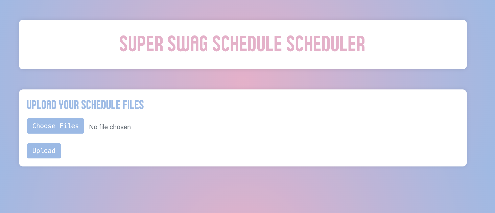
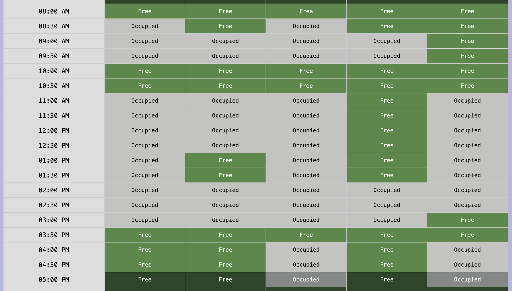

# Super Swag Schedule Scheduler

### Built by Team CATSK in 24 Hours for QuackHacks Winter 2025


Have you ever been frustrated trying to schedule a meeting time among your fellow UO students? With CATSK's Super Swag Schedule Scheduler, fret no more.

Using the "Choose File" button, select multiple student schedules downloaded in html format from Duckweb and upload using the "Upload" button.  The Super Swag Schedule Scheduler will compare them against each other to identify and display free time slots shared between all schedules. Now you can pick a meetup time. We save you the endless back-and-forth to pick a meeting time so you can focus on the important things, such as what you'll be having for dinner.

---

## Features
- **Upload Multiple Schedules**: Easily upload student schedules in HTML format.
- **Shared Free Time Detection**: Automatically detects and displays common free time slots.
- **User-Friendly Interface**: Clean and simple UI with a colorblind friendly color scheme, designed to save time and effort.

---

## Getting Started

### HTML File Download Instructions
Downloading the `.html` file needed to upload here can vary across computers. 

1. Log into Duckweb and navigate to the tab at the top labeled **‘Student Menu’**.
2. Navigate down to **‘Student Class Schedule’** and right-click on the **‘Concise Format’** button.  
   - If you see an option for **‘Download Linked File’**, select that option, and you have successfully downloaded the correct file.
3. If you do not see that option, left-click on the same **‘Concise Format’** button, select the term desired, and hit **‘Submit’**.
4. Then, right-click anywhere on the webpage and select **‘Save As…’**, then change the **‘Format’** (macOS) or **‘Save as type’** (Windows) to **‘Webpage, HTML Only’**, and save.


### Prerequisites
- Python 3.10 or higher
- **Dependencies**:
  - `beautifulsoup4` (for HTML parsing)
  - `Flask` (for the web application framework)

### Installation
1. Clone this repository:
   ```bash
   git clone https://github.com/your-repo/super-swag-schedule-scheduler.git

2. Navigate to the project directory:
   ```bash
   cd Hack_UO/quackhacks

3. Create and activate a virtual environment:
   ```bash
   python -m venv venv
   source venv/bin/activate  # On Windows, use `venv\Scripts\activate`

---

## Usage

1. Run the Flask application:
   ```bash
   flask run
2. Open your browser and navigate to `http://127.0.0.1:5000/`.
3. Use the "Choose File" button to select one or more HTML schedule files and upload them.
4. View shared free time slots directly on the web interface.

---

## Screenshots

### 1. Home Page


### 2. Schedule Display


---

## Technologies Used
- **Frontend**: HTML, CSS, Bootstrap
- **Backend**: Python, Flask
- **Parsing**: BeautifulSoup

## Contributors
- Tara Disser
- Aaron Reyes Rodriguez
- Sewon Sohn
- Kate Spencer
- Clio Tsao

---

## Acknowledgments
- Built with ❤️ by Team CATSK at QuackHacks Winter 2025.
- Special thanks to the University of Oregon for hosting the hackathon.

---

## Notes
- Date: January 18-19, 2025
- This project was built as a prototype during a 24-hour hackathon.

